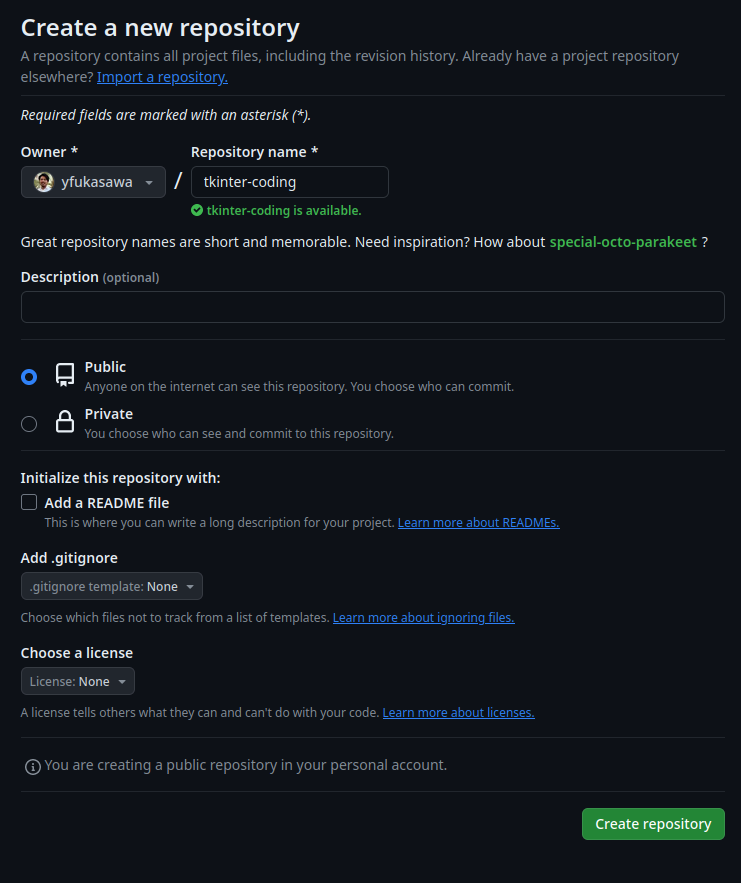
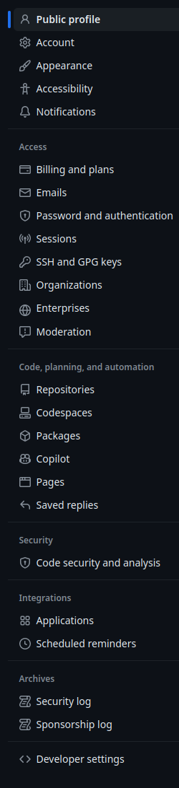
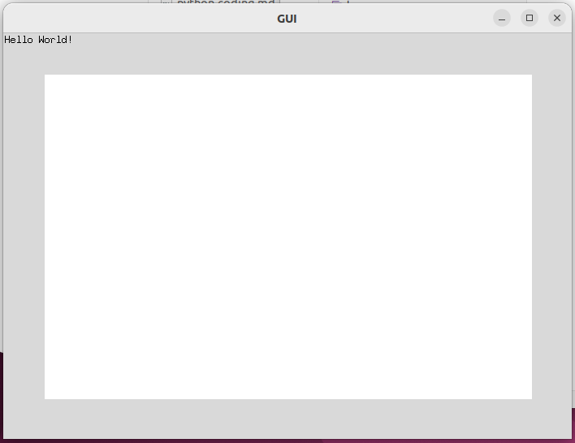

# Python 基礎 (第12週)

本コンテンツは[深沢研究室](https://c-bio.mine.utsunomiya-u.ac.jp/fukasawa/)でPythonを教えるために作成された演習資料です。

## 復習

### githubを使うのに必要なもの

1. ユーザー名
2. パスワード (Webなどでのログイン時に必要)
3. token (コードをwebにアップロードするときに必要)


## GUIとは

```{tips}
GUIとは、グラフィカルユーザインターフェース(Graphical User Interface)の略語。  
コンピュータへ出す命令や指示等を、ユーザが画面上で視覚的に捉えて行動を指定できるもので、それまで主流であった命令文を入力して実行する方式(CUI)に比べ、直感的に操作できるのが特長。
(出典: ITトレンド)
```

今まで使ってもらったターミナルのような画面をCUI(Character User Interface)と言います。マウスとかタッチパネルをあまり使わず、キーボードだけで操作するような画面ですね。  
例えば、皆さんのコードをバックアップするgitというソフトはCUI方式のソフトウェアです。

今まで作ってもらったソフトはすべてCUI方式のものです。作るのが簡単だという利点ですね。  
GUIをどうやって書くか、少し触れていきましょう。

## tkinterでHello World

では、まず新しいフォルダを作りましょう。  
ターミナルを開いて、以下のように打ってみてください。

```
mkdir ~/projects/tkinter-coding
```
projectsというフォルダの中にtkinter-codingというフォルダを作りました。

Visual Studio Codeを開き、上で作った~/projects/tkinter-codingを開いてください。  

FileからNew Windowを開くとわかりやすいかもしれません。新しいウィンドウが開いたらFile-Open Folderで~/projects/tkinter-codingを開きましょう。


新しくgui.pyと名付け~/projects/tkinter-codingへ保存してください。
では、最初の画面を描きます。

```{code-block}
import tkinter as tk
import time

window_width  = 700
window_height = 500

def main():
    window = tk.Tk()
    window.geometry("%dx%d" % (window_width, window_height))

    # Windowのタイトル
    window.title("GUI")

    label = tk.Label(window, text="Hello World!")
    label.place(x=0, y=0)

    window.mainloop()

if __name__ == "__main__":
    main()
```

書けたらターミナルで以下をします。

```{code-block}
cd ~/projects/tkinter-coding
python3 gui.py
```

**演習**

1. ウインドウの大きさを変えて、
2. ウインドウのタイトルを変えて、
3. Hello Worldを何か別の言葉に変えてみてください。

ここまで出来たら一旦、githubにアップロードしてみましょう。　　


```{code-block}
cd ~/projects/tkinter-coding
git init
```

次に`.gitignore`というファイルを開き、以下を加えます。  
myenvなどは適宜変えてください。  
```{code-block}
*.pyc
*~
/.vscode
__pycache__
.DS_Store
```

ターミナルで以下を実行します。

```{code-block}
git add --all .
git commit -m "最初のコミット"
```

これを前回同様githubにアップロードしていきます。  

ログインして、newというボタンを押しましょう。
すると以下のような画面になります。  
Repository nameというところにアプリ名を入れましょう。



以下が例です。  

>https://github.com/yfukasawa/tkinter-coding

ここまで出来たら、ターミナルに戻って、以下を入力してください。
```{code-block}
git remote add origin https://github.com/アカウント名/tkinter-coding.git
git branch -M main
git push -u origin main
```

ここまでやるまでにエラーができるかもしれません。  
その際には、githubで使うtokenと呼ばれるパスワードのようなものを生成しておきます。  



一番下のDeveloper settingsへ行くと以下の画面が出ます。  


## tkinterでスクリーンセーバーもどき

ここまで出来たら、ボールを動かす画面を作ってみましょう。  

Windowの上にCanvasというものを作ります。油絵などを描くキャンバスですね。  
Windowの上にCanvasというものを置いて、さらにそのCanvasの上に円や四角を描いたりする感じです。
まず、Canvasを用意してみましょう。  

windowのサイズの下に、1)canvasサイズを指定する変数、2)円を情報を覚えておく変数(辞書型)、3)円(楕円)を描く関数を追加。

```
window_width  = 700
window_height = 500

canvas_width  = 600
canvas_height = 400

# co: circle_object
co = {
    "x": 350,
    "y": 250,
    "dx": 10,
    "dy": 10,
    "r": 5
}

def create_circle(canvas, x, y, r, **kwargs):
    return canvas.create_oval(x-r, y-r, x+r, y+r, **kwargs)
```

main関数を変更し、白いキャンバスを表示させましょう。
```
def main():
    window = tk.Tk()
    window.geometry("%dx%d" % (window_width, window_height))

    # Windowのタイトル
    window.title("GUI")

    label = tk.Label(window, text="Hello World!")
    label.place(x=0, y=0)

    canvas = tk.Canvas(window, width=canvas_width, height=canvas_height, bg="white")
    canvas.place(x=(window_width-canvas_width)/2, y=(window_height-canvas_height)/2)

    window.mainloop()
```

こんな感じです。


最後に、ボールを表示させましょう。

```
def main():
    window = tk.Tk()
    window.geometry("%dx%d" % (window_width, window_height))

    # Windowのタイトル
    window.title("GUI")

    label = tk.Label(window, text="Hello World!")
    label.place(x=0, y=0)

    canvas = tk.Canvas(window, width=canvas_width, height=canvas_height, bg="white")
    canvas.place(x=(window_width-canvas_width)/2, y=(window_height-canvas_height)/2)

    circle = create_circle(canvas, co["x"], co["y"], co["r"], fill="blue")

    window.mainloop()
```

**演習**

1. ボールの位置を変えてください。
2. ボールのサイズを変えてください。
3. 最後に、ボールの色を変えてください。


ここまで出来たら一旦、githubにアップロードしてみましょう。　

```{important}
ボールだけでは面白くないので、何か画像を追加してください。  
追加し表示を確認したら、githubへアップロードをお願いします。  
ここまで終われば、githubのURLを送ってください。  

https://github.com/アカウント名/tkinter-coding.git

**締め切り: 2/5(月) 22時**
```

今週はここまでです。お疲れさまでした。

