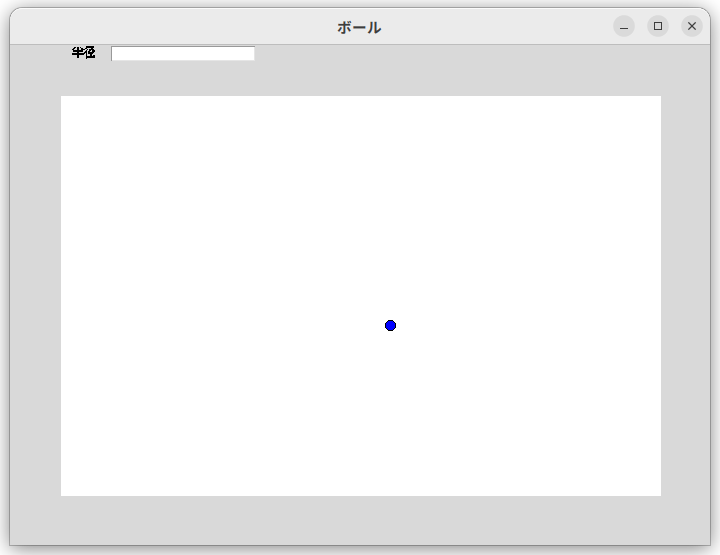
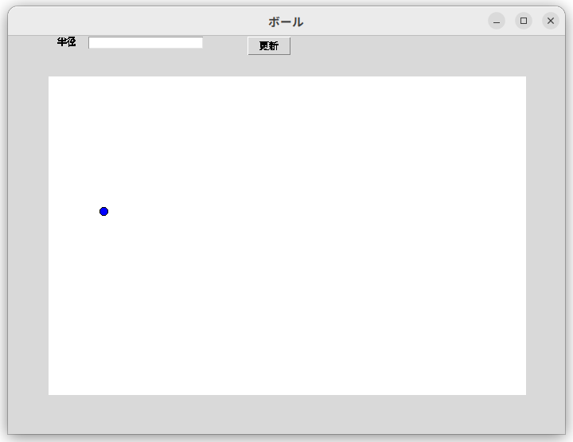
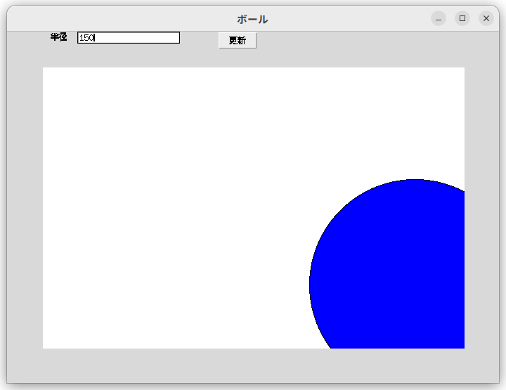

# Python 基礎 (第14週)

本コンテンツは[深沢研究室](https://c-bio.mine.utsunomiya-u.ac.jp/fukasawa/)でPythonを教えるために作成された演習資料です。

## 復習

### githubを使うのに必要なもの

1. ユーザー名
2. パスワード (Webなどでのログイン時に必要)
3. token (コードをwebにアップロードするときに必要)

### 新しいpythonのインストール(必要な人向け)

Macに入っているPythonが古い場合、以下で書くGUIが動作しません。その場合は、以下の手順で`conda`と呼ばれるソフトを入れるソフトをインストールしましょう。

参考: githubページ  
https://github.com/conda-forge/miniforge

1. ターミナルを開いてください。
2. 以下のコマンド(curlで始まる行とbashで始まる行の2行です)をそれぞれ１行ずつ実行してください。

```{code-block}
curl -L -O "https://github.com/conda-forge/miniforge/releases/latest/download/Miniforge3-$(uname)-$(uname -m).sh"

bash Miniforge3-$(uname)-$(uname -m).sh
```

3. 終わったら１回ターミナルを終了して、もう１度開くと良いと思います。
4. 左に`(base)`と表示されていたら成功です。

## GUIアプリケーション続き

```{tips}
GUIとは、グラフィカルユーザインターフェース(Graphical User Interface)の略語。  
コンピュータへ出す命令や指示等を、ユーザが画面上で視覚的に捉えて行動を指定できるもので、それまで主流であった命令文を入力して実行する方式(CUI)に比べ、直感的に操作できるのが特長。
(出典: ITトレンド)
```

## [復習] tkinterでボールを描画

今回は、引き続きGUIを作っていきます。まずは、動くボールを表示させましょう。

```
import tkinter as tk
import time

window_width  = 700
window_height = 500

canvas_width  = 600
canvas_height = 400

# co: circle_object
co = { "x": 350, "y": 250, "dx": 10, "dy": 10, "r": 5}

def create_circle(canvas, x, y, r, **kwargs):
    return canvas.create_oval(x-r, y-r, x+r, y+r, **kwargs)

def move_circle(x, y, dx, dy):
     # 仮の変数に移動後の値を記録
     _x = x + dx
     _y = y + dy
     # 上左右の壁に当たった？
     if _x < 0 or _x > canvas_width:
         dx *= -1
     if _y < 0 or _y > canvas_height:
         dy *= -1
     # 移動内容を反映
     if 0 <= _x <= canvas_width:
         x = _x
     if 0 <= _y <= canvas_height:
         y = _y

     return _x, _y, dx, dy

def main():
    window = tk.Tk()
    window.geometry("%dx%d" % (window_width, window_height))

    # Windowのタイトル
    window.title("GUI")

    label = tk.Label(window, text="Programming training")
    label.place(x=0, y=0)

    canvas = tk.Canvas(window, width=canvas_width, height=canvas_height, bg="white")
    canvas.place(x=(window_width-canvas_width)/2, y=(window_height-canvas_height)/2)

    while True:
        # Create a circle
        circle = create_circle(canvas, co["x"], co["y"], co["r"], fill="blue")
        co["x"], co["y"], co["dx"], co["dy"] = move_circle(co["x"], co["y"], co["dx"], co["dy"])

        time.sleep(0.04)
        window.update()
        canvas.delete(circle)

    window.mainloop()


if __name__ == "__main__":
    main()

```

## 色々なGUIパーツの表示

ラベル、テキストフィールドというものを配置してみましょう。  
ラベルは使いましたが、テキストフィールドは初めてですね。

```{code-block}
    label = tk.Label(window, text="Programming training")
    label.place(x=0, y=0)

    # パラメータ
    label_rad = tk.Label(text="半径")
    label_rad.place(x=10, y=10)
    par_rad = tk.Entry()
    par_rad.place(x=10, y=10)
```

**演習**

1. ラベル、フィールドを確認してください。
2. それぞれの位置を整えてキャンバスの上に横並びになるようにしてください。


　

## ボタンの配置と値の取得

目的はお分かりかもしれませんが、半径の値を入力してボールの大きさを変えることです。
値を入力するためのフィールド(白いボックス)以外に、何が必要でしょうか？

こういう時は、１つはボタンを使います。  
ボタンを配置してみましょう。

```{code-block}
    label = tk.Label(window, text="Programming training")
    label.place(x=0, y=0)

    # パラメータ
    label_rad = tk.Label(text="半径")
    label_rad.place(x=10, y=10)
    par_rad = tk.Entry()
    par_rad.place(x=10, y=10)
    button_rad = tk.Button(text="更新")
    button_rad.place(x=10, y=0)
```



**演習**

1. ボタンの位置を整えてキャンバスの上に横並びになるようにしてください。

## イベントの定義

このままだと、クリックしても反応しません。
こういう時は、**ボタンを押した時のプログラムの挙動**を決める必要があります。　　

`getRadiusValue()`

という関数を書いてみましょう。  
**main()**　の下に以下のように書いてください。
白いボックス内の数字を読み込んで、円の半径を保持する変数co["r"]に入れることにします。

```
def main():

    def getRadiusValue(event):
        r = int(par_rad.get())
        print("debug: %d" % r)
        co["r"] = r

    window = tk.Tk()
    window.geometry("%dx%d" % (window_width, window_height))
    window.geometry("700x500")
```

ただ、このままだと、動きません。`getRadiusValue()`が動かないからです。  
ボタンが押されたら上のgetRadiusValue()が呼ばれるようにしたいので、少しだけ書き足します。

`.bind()`

ボタンに対して上を定義しておくと、アクションが起きた時に(クリックなど)関数を呼ぶように出来ます。

```{code-block}
    label = tk.Label(window, text="Programming training")
    label.place(x=0, y=0)

    # パラメータ
    label_rad = tk.Label(text="半径")
    label_rad.place(x=10, y=10)
    par_rad = tk.Entry()
    par_rad.place(x=10, y=10)
    button_rad = tk.Button(text="更新")
    button_rad.bind("<Button-1>", getRadiusValue) ## ←← ここが大事
    button_rad.place(x=10, y=0)
```



**演習**

1. ボールの大きさが変わるか確認してください。


```{important}
上のコードは左クリックで動きますが、右クリックで動くように変更してください。   
追加し表示を確認したら、githubへアップロードをお願いします。  
ここまで終われば、githubのURLを送ってください。  

https://github.com/アカウント名/tkinter-coding.git

```

今週はここまでです。お疲れさまでした。

