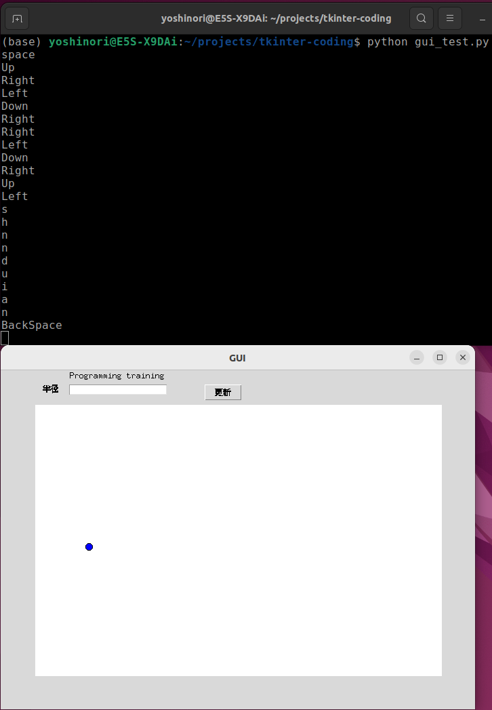

# Python 基礎 (第15週)

本コンテンツは[深沢研究室](https://c-bio.mine.utsunomiya-u.ac.jp/fukasawa/)でPythonを教えるために作成された演習資料です。

## 復習

### githubを使うのに必要なもの

1. ユーザー名
2. パスワード (Webなどでのログイン時に必要)
3. token (コードをwebにアップロードするときに必要)

## [復習] tkinterでボールを描画

今回は、引き続きGUIを作っていきます。まずは、動くボールを表示させましょう。

```
import tkinter as tk
import time

window_width  = 700
window_height = 500

canvas_width  = 600
canvas_height = 400

# co: circle_object
co = { "x": 350, "y": 250, "dx": 10, "dy": 10, "r": 5}

def create_circle(canvas, x, y, r, **kwargs):
    return canvas.create_oval(x-r, y-r, x+r, y+r, **kwargs)

def move_circle(x, y, dx, dy):
     # 仮の変数に移動後の値を記録
     _x = x + dx
     _y = y + dy
     # 上左右の壁に当たった？
     if _x < 0 or _x > canvas_width:
         dx *= -1
     if _y < 0 or _y > canvas_height:
         dy *= -1
     # 移動内容を反映
     if 0 <= _x <= canvas_width:
         x = _x
     if 0 <= _y <= canvas_height:
         y = _y

     return _x, _y, dx, dy

def main():

    def getRadiusValue(event):
        r = int(par_rad.get())
        print("debug: %d" % r)
        co["r"] = r

    window = tk.Tk()
    window.geometry("%dx%d" % (window_width, window_height))

    # Windowのタイトル
    window.title("GUI")

    label = tk.Label(window, text="Programming training")
    label.place(x=100, y=0)

    # パラメータ
    label_rad = tk.Label(text="半径")
    label_rad.place(x=60, y=20)
    par_rad = tk.Entry()
    par_rad.place(x=100, y=20)
    button_rad = tk.Button(text="更新")
    button_rad.bind("<Button-1>", getRadiusValue) ## ←← ここが大事
    button_rad.place(x=300, y=20)

    canvas = tk.Canvas(window, width=canvas_width, height=canvas_height, bg="white")
    canvas.place(x=(window_width-canvas_width)/2, y=(window_height-canvas_height)/2)

    while True:
        # Create a circle
        circle = create_circle(canvas, co["x"], co["y"], co["r"], fill="blue")
        co["x"], co["y"], co["dx"], co["dy"] = move_circle(co["x"], co["y"], co["dx"], co["dy"])

        time.sleep(0.04)
        window.update()
        canvas.delete(circle)

    window.mainloop()

if __name__ == "__main__":
    main()

```

## キーボードの入力を受け付け

前回はマウスの入力を考えましたが、今回はキーボードの入力を考えてみます。  
まずは、スペースキーを押すと動作を止め、再度スペースを押すと動作を再開するような機能を追加していきましょう。  

その準備として、キーボードの入力を受け付けるように変更しましょう。  
前回つかった`.bind()`というものを再び使いましょう。マウスだとボタンにつけるのが直感的ですが、今回のキーボードの場合はウィンドウ全体を操作したいので`window`に`.bind()`します。  
ここで、`window`とはTk()という関数で作った変数のことです(参考例: `window = tk.Tk()`)。

`<KeyPress>`というパラメータをbind()に与えると、任意(特定のものではない、という意味です)のキー入力でkey_input()という関数を呼び出せるようにします。

```{code-block}
    window.title("GUI")
    # キー入力
    window.bind("<KeyPress>", key_input)
```

```{code-block}
def key_input(event):
    print(event.keysym)
```

**演習**

1. key_inputという関数をどこに書くべきか決めてください。
2. 自分のターミナルに押したキーが表示されるのを確認してください。
3. ifを使って、スペースキーを押した時にだけprintするようにkey_input()を変更してください。ヒント: `tkinterでスペースキーを押すと、keysymという変数に"space"という文字を返します。`


　

## 「状態」という概念

動作の制御に必要な情報は何でしょうか。現在の「状態」を保持しておく必要があります。この場合は、ボールが「動いている」と「動いていない」の2つの状態だけとします。  
こういうとき、プログラミングの世界ではブーリアン (Boolean)という変数を使います。TrueとFalse、真と偽、2進数の0と1など、表現の仕方は様々ですが2つというのがポイントです。  
Pythonでは、TrueとFalseを用います。

is_stoppedという変数を使います。こういう変数はフラグ、などと呼ばれたりもします。  
この変数は後で使います。  

```{code-block}
canvas_width  = 600
canvas_height = 400

is_stopped  = False # ブーリアン型の変数を定義
```

続いて、動作を止めるにはどうするべきか考えましょう。1つのやり方はボールのパラメータを変更することだと言えます。
この場合、止める直前のパラメータを保持しておく必要があるので、**t_co**という変数を作ってみましょう。

```{code-block}
# co: circle_object
co = { "x": 350, "y": 250, "dx": 10, "dy": 10, "r": 5}
t_co = {"x": 0, "y": 0, "dx": 0, "dy": 0, "r": 0}

def stop_and_go():
    global is_stopped
    if is_stopped:
        is_stopped = False
        for x in t_co:
            co[x] = t_co[x]
    else:
        is_stopped = True
        for x in co:
            t_co[x] = co[x]
        co["dx"] = co["dy"] = ??
```

```{code-block}
def key_input(event):
    if event.keysym == ??:
        print("debug: space key is hit.")
        stop_and_go()
```

**演習**

1. stop_and_go()という関数を完成させてください。
2. key_input()からスペースキーが押された時に、stop_and_go()を呼び出すようにしてください。
3. ボールがスペースキーで止まったり動いたりすることを確認してください。

## キーボードによるパラメータの変更

動作を止めたりするだけではなく、ボールを動かせるようにしてみましょう。  
位置というパラメータ(変数)を変えれば実現できそうです。　　

`move_circle_key()`

という関数を書いてみましょう。  
以前にtkinterが自動でボールを動かす`move_circle()`という関数を作りましたが、それをキーボードでマニュアルで行うようにする関数です。
このとき、ボールが動いていると難しいので、停止「状態」のときにだけ反応するようにしましょう。

```{code-block}
def move_circle_key(a, b):
    global co, t_co
    if not is_stopped:
        return
    _x = co["x"] + a
    _y = co["y"] + b
    if _x < 0 or _x > canvas_width:
        a = 0
    if _y < 0 or _y > canvas_height:
        b = 0
    
    co["x"]   += a
    t_co["x"] += a
    co["y"]   += b
    t_co["y"] += b
```

このままだとキーボードに反応しないので、key_input()からmove_circle()を呼び出すようにしてください。

```{code-block}
def key_input(event):
    print("debug: %s is hit." % event.keysym)
    if event.keysym == "space":
        stop_and_go()
    elif event.keysym==??:
        move_circle_key(??, ??)
    elif event.keysym==??:
        move_circle_key(??, ??)
    # お好みで続けてください。
```

**演習**

1. key_input()を変更し、キーボードによる移動を決めてみてください。
2. 動作が自分の期待通りか確認してみてください。


```{important}
大分進んできました。
上のコードに数字を入力する欄を２つ追加し、 位置を半径のように数字を入力しても変更できるようにしてみてください。 
動作を確認したら、githubへアップロードをお願いします。  
ここまで終われば、githubのURLを送ってください。  

https://github.com/アカウント名/tkinter-coding.git

```

今週はここまでです。お疲れさまでした。

