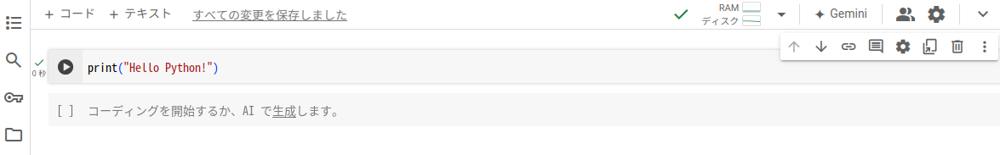

# Python 基礎 (第1週) 

本コンテンツは[深沢研究室](https://c-bio.mine.utsunomiya-u.ac.jp/fukasawa/)でPythonを教えるために作成された演習資料です。
Colaboratoryの使い方と変数という概念を学びます。

## Google Colaboratoryの使い方 (Googleアカウント取得済み学生向け)

Google Colaboratory (Colab) は、ブラウザ上で Python を記述・実行できる無料のクラウドサービスです。プログラミングや機械学習の学習や研究に非常に便利です。

ここでは Google アカウントを取得済みの学生向けに、Colab の基本的な使い方をステップごとに解説します。

### ステップ 1: Google Colaboratory にアクセスする
1. ブラウザで Google Colaboratory にアクセスします。
2. **Google アカウントでログインします。**

### ステップ 2: 新しいノートブックを作成する
1. Colab のトップページで、「ファイル」>「ノートブックを新規作成」をクリックします。
2. 新しいノートブックが開きます。ノートブックは、コードセルとテキストセルで構成されています。

### ステップ 3: コードセルに Python コードを記述する
1. コードセルをクリックして、Python コードを入力します。

```{code-block}
print("Hello Python!")
```

### ステップ 4: コードセルを実行する
1. コードセルの左側にある実行ボタン (再生ボタンのようなアイコン) をクリックします。
2. コードが実行され、結果がセルの下に表示されます。

>Hello Python!



### ステップ 5: テキストセルに説明などを記述する
1. テキストセルをクリックして、Markdown 形式で説明などを記述します。

```{code-block}
Colaboratory の使い方
これは Colaboratory の使い方を説明するテキストセルです。
**太字** や *斜体* も使えます。
```

### ステップ 6: ノートブックを保存する
1. 「ファイル」>「名前を付けて保存」をクリックして、ノートブックに名前を付けて Google ドライブに保存します。

### ステップ 7: その他の便利な機能
1. ライブラリのインポート: import 文を使って、必要なライブラリをインポートできます。

```{code-block}
import numpy as np
import pandas as pd
```

- GPU の使用: 「ランタイム」>「ランタイムのタイプを変更」で、ハードウェアアクセラレータを GPU に設定することで、GPU を使った高速な計算ができます。
- ファイルのアップロード/ダウンロード: Colab のファイルブラウザから、ファイルをアップロード/ダウンロードできます。
- Google ドライブとの連携: Google ドライブ上のファイルを Colab で直接開いたり、Colab で作成したファイルを Google ドライブに保存したりできます。

## 変数

### ステップ 1: 変数とは何か?
変数は、値を格納するための名前付きの箱のようなものです。
コンピュータのメモリ上に値を保存し、後でその値を参照するために使用します。
日常生活で例えると、名前がラベルのついた箱に物を入れるようなイメージです。

### ステップ 2: 変数への値の代入方法
変数に値を代入するには、「=」（イコール記号）を使います。
左側に変数名、右側に代入したい値を記述します。

```
# 変数名「name」に文字列「太郎」を代入
name = "太郎" 

# 変数名「age」に整数値20を代入
age = 20
```

### ステップ 3: 変数の値の使い方

変数に格納された値は、変数名を使って参照できます。
print() 関数を使って、変数の値を表示することができます。

```
name = "太郎"
age = 20

print(name)  # 出力: 太郎
print(age)   # 出力: 20

```

### ステップ 4: 変数の値の更新方法

変数に格納されている値は、後で変更することができます。
新しい値を代入することで、変数の値を更新できます。

```
age = 20
print(age)  # 出力: 20

age = 21 
print(age)  # 出力: 21
```

### ステップ 5: さまざまなデータ型の変数
変数には、数値、文字列、真偽値など、さまざまな種類のデータを格納できます。
Pythonはデータ型を自動的に判別してくれるので、明示的に指定する必要はありません。

```
name = "花子"  # 文字列
score = 90.5  # 浮動小数点数
is_passed = True # 真偽値
```

### ステップ 6: 変数の命名規則

変数名は、アルファベット、数字、アンダースコア(_) を使うことができます。
数字で始めることはできません。
大文字と小文字は区別されます。
意味のある名前をつけることが重要です。

```
# 良い例
user_name = "太郎"
total_score = 100

# 悪い例
1st_place = "花子"  # 数字で始まっている
userName = "次郎"   # 大文字小文字が混在
a = 10             # 意味がわからない
```

## まとめ
Colab は、Python の学習や機械学習の実験に非常に便利なツールです。 ぜひ積極的に活用して、プログラミングスキルを向上させてください。