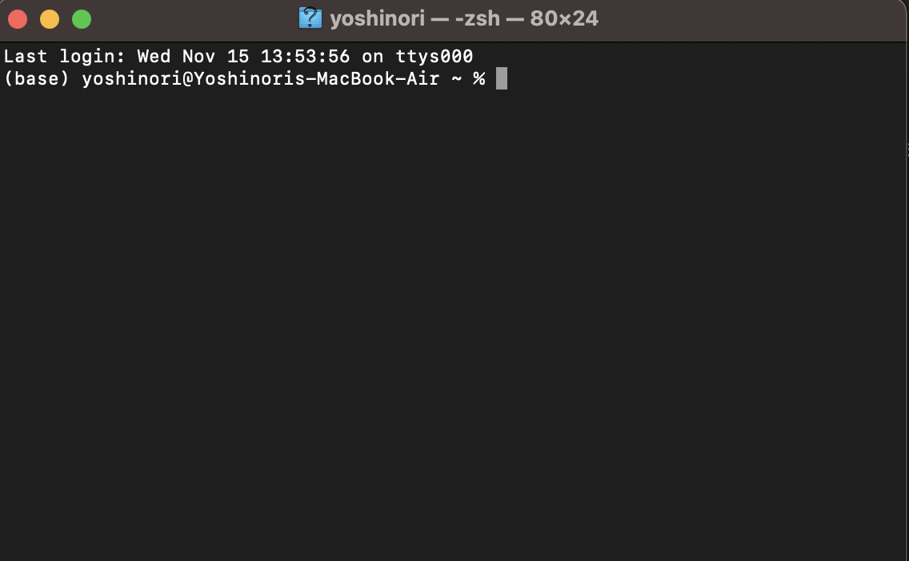
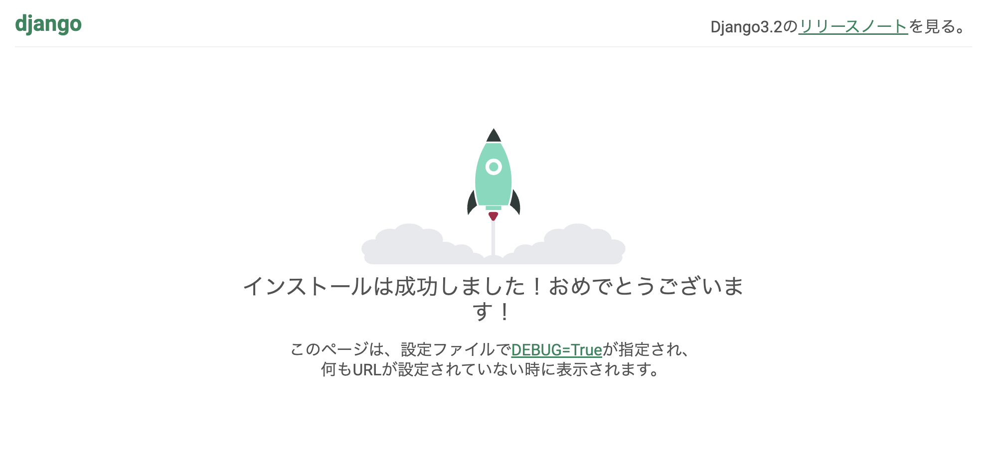
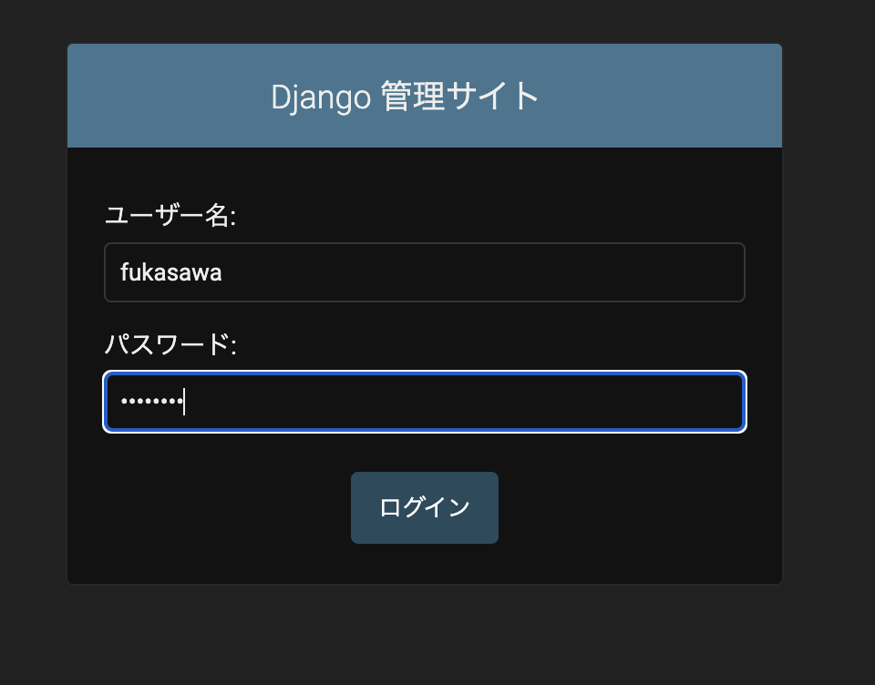

# Python 基礎 (第10週)

本コンテンツは[深沢研究室](https://c-bio.mine.utsunomiya-u.ac.jp/fukasawa/)でPythonを教えるために作成された演習資料です。

## 復習

```{important}
HTMLは文章をキレイにする良い方法ですが、それだけですとWordでも出来ます。  
HTMLとHTTPが革新的だった理由はリンクだと考えています。  
\<A>というリンクを張るタグがあるので、書き方を調べて、Aタグを使ってリンクのあるHTML文書を作成してください。
```
文章を繋げるというやり方は、仕事や情報収集のやり方を劇的変え、またそこから来たWebの台頭は今日のAIの土台にもなっています。

## Webアプリ開発の準備

今週からはPythonの基礎は大分身についてきたかと思うので、応用編に入っていきます。  

### 自分の環境で実行してみる

ターミナルというソフトを実行してみましょう。  
`Finder`を開くと、`アプリケーション`という項目があると思いますが、その中に`ユーテリティ`というフォルダがあります。それを開いてみてください。
その中に`ターミナル`というソフトが入っているので、ダブルクリックで開きましょう。  


見た目が異なるかもしれませんが、下のような文字だけの画面が出てくるかと思います。



```{code-block}
$ python --version
```

と打ち込んでみましょう。もし`zsh: command not found: python`と出てきた場合は、以下のように3を付けてみてください。

```{code-block}
$ python3 --version
```

```{note}
なぜターミナルは便利なのか？  
コマンド操作は面倒ですが、慣れると人間では出来ないスピードで仕事が進みます。  
例えば、数百ファイルの自動ダウンロードなどは、人間がマウスで操作すると大変です。
また、一度慣れると外部のマシン(数百キロ、数千キロ離れたコンピュータ)に簡単に接続し、同じように仕事できるからです。  
リモートワークをする技術は重要で、それがあるからこそ地方の家賃で都市圏の収入を得たり出来るわけです。
```

まず作業するフォルダを新規に作成しましょう。  
プロジェクト名をファルダ名によくします。

```{code-block}
$ mkdir -p ~/projects/my-great-webapp
$ cd ~/projects/my-great-webapp
```

詳しくは説明できませんが仮想環境というものを構築します。  
このフォルダの中に隔離した環境を作ります。  
myvirtenvという名前にしていますが、好きな名前で結構です。  
慣れてくるといくつも同時に進行しますが、お互いに影響を与えないようにするための技術です。

```{code-block}
$ python3 -m venv myvirtenv
$ source myvirtenv/bin/activate
```

これからしばらく使うDjangoというものをインストールします。  

```{code-block}
$ python -m pip install --upgrade pip
$ pip install django~=3.2.10
```

### Django
Django（ジャンゴ)は無料のオープンソースとして提供されているWebアプリケーションフレームワークと呼ばれます。素早く簡単にウェブサイトやウェブアプリケーションを作るための一式が含まれています。  

```{code-block}
$ cd ~/projects/my-great-webapp 
$ django-admin startproject mysite .
```

Finderで見てみましょう。
mysiteというフォルダの中にsettings.pyというPythonのコードがあります。  
変えてみましょう。

**演習**

1. mysite/settings.pyを開きます。  
2. TIME_ZONEとLANGUAGE_CODEという変数を探し以下のようにしてみましょう。  
    > TIME_ZONE = 'Asia/Tokyo'  
    > LANGUAGE_CODE = 'ja'  
3. ALLOWED_HOSTSというリストを探し、以下のように入れてください。注: pythonanywhere.comの前に小さいドットがあります。
    > ALLOWED_HOSTS = ['127.0.0.1', '.pythonanywhere.com'] 
4. STATIC_URL = '/static/'という行の下に以下を入力してください。  
    >STATIC_URL = '/static/'  
    >STATIC_ROOT = BASE_DIR / 'static'


### アプリの起動

ターミナルに以下のように打って実行してみてください。

```{code-block}
$ python manage.py migrate
$ python manage.py runserver  
```

ブラウザで下のURLを開くとノートパソコンで動く小さいアプリの画面が出るはずです。
>http://127.0.0.1:8000



画面が出ましたか？出たら成功です！

## Djangoの編集

```{code-block}
$ python manage.py startapp [web-app-name]
```
promptという名前にして進めていきます。

```{code-block}
$ python manage.py startapp prompt
```

まず、mysite/settings.pyをもう一度編集します。

```{code-block}
# mysite/settings.py
INSTALLED_APPS = [
    'django.contrib.admin',
    'django.contrib.auth',
    'django.contrib.contenttypes',
    'django.contrib.sessions',
    'django.contrib.messages',
    'django.contrib.staticfiles',
    'prompt.apps.PromptConfig', ### NEW ###
]
```

これに加えて、promptというフォルダの中のmodels.pyというファイルを編集します。
以下をコピペしてみてください。

```{code-block}
# prompt/models.py
from django.conf import settings
from django.db import models
from django.utils import timezone

class Prompt(models.Model):
    author = models.ForeignKey(settings.AUTH_USER_MODEL, on_delete=models.CASCADE)
    prompt = models.TextField()
    posted_date = models.DateTimeField(default=timezone.now)
```

同様に、promptというフォルダの中のadmin.pyというファイルを編集します。  
以下をコピペしてみてください。

```{code-block}
# prompt/admin.py
from django.contrib import admin
from .models import Prompt

admin.site.register(Prompt)
```

編集後に実行します。

```{code-block}
$ python manage.py makemigrations prompt
$ python manage.py migrate prompt
$ python manage.py runserver
```

ブラウザで下のURLを開くとノートパソコンで動く小さいアプリの画面が出るはずです。
>http://127.0.0.1:8000/admin/

ただ、まだユーザーアカウントがないので、ログインできません。  
あなたのアプリの管理者となるアカウントを作りましょう。(スーパーユーザーなどと呼ばれます。)

```{code-block}
$ python manage.py createsuperuser
```



```{important}
ブラウザで以下のサイトに行ってgitをダウンロードします。
>git-scm.com

そして、新しくgithubのアカウントを作成しましょう。パスワードはくれぐれも忘れないようにしてください。
>Github.com

PythonAnywhereのアカウント作成
>https://www.pythonanywhere.com/

ありがたいことに、無料です！クレジットカードは要らないので安心してください。  
webアプリの開発は 1)自分のコンピュータ, 2)インターネットで誰でもアクセス可能な24時間稼働しているコンピュータ(webサーバーなどと呼ばれます)の両方を使って行ったり来たりします。これはそのwebサーバーを提供してくれるサービスになります。
```

今週はここまでです。お疲れさまでした。

