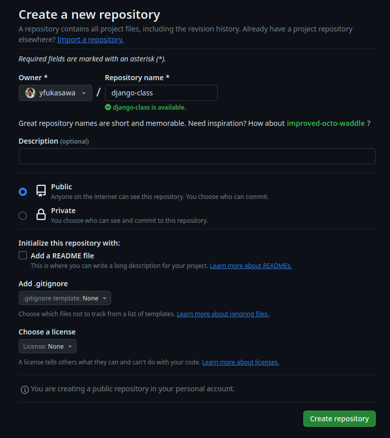
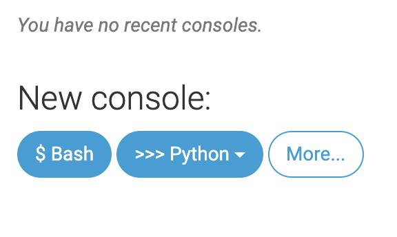

# Python 基礎 (第11週)

本コンテンツは[深沢研究室](https://c-bio.mine.utsunomiya-u.ac.jp/fukasawa/)でPythonを教えるために作成された演習資料です。

## 復習

### アプリの起動

ターミナルに以下のように打って実行してみてください。

```{code-block}
$ python manage.py migrate
$ python manage.py runserver  
```

ブラウザで下のURLを開くとノートパソコンで動く小さいアプリの画面が出るはずです。
>http://127.0.0.1:8000


画面が出ましたか?

## Djangoの編集

では、準備が出来たのでアプリケーションを作っていきましょう。  
なかなかイメージがわかないかもしれませんが、webアプリケーションというのは基本的に何かデータがあって、それをインターネットの向こう側にあるサーバーで処理し、自分のマシン（PCやスマホ)で見るようなものです。  
現在では当たり前のようにありますが、ここ10年くらいで急速に発展してきました。  
DjangoはPythonでこういったwebアプリを作る手助けをしてくれるもので、Webアプリのフレームワークなどと呼ばれます。こういったものを0から作るのは大変なので、先人たちがそれに沿って作るとアプリができるようにしたものがフレームワークです。

インスタやSpotify、私も知りませんでしたがYoutubeもDjangoで構成されているそうです。(https://www.netguru.com/blog/django-apps-examples)

```{code-block}
$ python manage.py startapp [web-app-name]
```
promptという名前にして進めていきます。

```{code-block}
$ python manage.py startapp prompt
```

まず、mysite/settings.pyをもう一度編集します。  
`'[web-app-name].apps.PromptConfig',`というラインを加えてください。  
下の例はpromptという名前を使用しています。

```{code-block}
# mysite/settings.py
INSTALLED_APPS = [
    'prompt.apps.PromptConfig', ### NEW ###
    'django.contrib.admin',
    'django.contrib.auth',
    'django.contrib.contenttypes',
    'django.contrib.sessions',
    'django.contrib.messages',
    'django.contrib.staticfiles',
]
```

これに加えて、prompt（もしくは、自分のアプリ名）というフォルダの中のmodels.pyというファイルを編集します。
以下をコピペしてみてください。

```{code-block}
# prompt/models.py
from django.conf import settings
from django.db import models
from django.utils import timezone

class Prompt(models.Model):
    author = models.ForeignKey(settings.AUTH_USER_MODEL, on_delete=models.CASCADE)
    prompt = models.TextField()
    posted_date = models.DateTimeField(default=timezone.now)
```

同様に、promptというフォルダの中のadmin.pyというファイルを編集します。  
以下をコピペしてみてください。

```{code-block}
# prompt/admin.py
from django.contrib import admin
from .models import Prompt

admin.site.register(Prompt)
```

編集後に実行します。

```{code-block}
$ python manage.py makemigrations prompt
$ python manage.py migrate prompt
$ python manage.py runserver
```

ブラウザで下のURLを開くとノートパソコンで動く小さいアプリの画面が出るはずです。
>http://127.0.0.1:8000/admin/

ただ、まだユーザーアカウントがないので、ログインできません。  
あなたのアプリの管理者となるアカウントを作りましょう。(スーパーユーザーなどと呼ばれます。)

```{code-block}
$ python manage.py createsuperuser
```


## 自分のコードを一般公開する

今作っているサイトを公開し、誰でもアクセスできるようにしたいと思います。  
我々のマシンでも出来なくはないですが、高度なセキュリティが要求されるため外部のサービスを使用します。
PythonAnywhereがそれに当たります。

その前に、前回入れたgitというものを使って、自分のコードをバックアップしつつ一般公開します。一般公開とは、要は世界中の人に見せることです。

```{code-block}
cd ~/projects/my-great-webapp
git init
git config --global user.name "自分の名前(alphabetで)"
git config --global user.email you@example.com
```

次に`.gitignore`というファイルを開き、以下を加えます。  
myenvなどは適宜変えてください。  
```{code-block}
*.pyc
*~
/.vscode
__pycache__
myvenv ## 仮想環境の名前
db.sqlite3
/static
.DS_Store
```

ターミナルで以下を実行します。

```{code-block}
git add --all .
git commit -m "最初のコミット"
```

これをgithubというwebサービスにアップロードしていきます。  
ITの世界で売り込む時はこれを見せるのが通例なので、たまに整理しておくと良いです。  

ログインして、newというボタンを押しましょう。
すると以下のような画面になります。  
Repository nameというところにアプリ名を入れましょう。



以下が例です。  

>https://github.com/yfukasawa/ai-prompt-manager

ここまで出来たら、ターミナルに戻って、以下を入力してください。
```{code-block}
git remote add origin https://github.com/<your-github-username>/<your-app-name>.git
# 例えば下のように書きます。
# git remote add origin https://github.com/yfukasawa/ai-prompt-manager.git
git branch -M main
git push -u origin main
```

ここまでやるまでにエラーができるかもしれません。  
その際には、githubで使うtokenと呼ばれるパスワードのようなものを生成しておきます。  


一番下のDeveloper settingsへ行くと以下の画面が出ます。  


## PythonAnywhereへ読み込む




PythonAnywhereのターミナルで以下を打ってください。  
自分のマシンのターミナルではないです！

```{code-block}
pip3.6 install --user pythonanywhere
git clone https://${アクセストークン}@${ユーザー名}/${リポジトリ名}.git
```

```{important}
githubのコード、もしくは、PythonAnywhereのリンクを送ってください。
```
今週はここまでです。お疲れさまでした。

